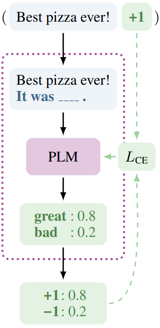
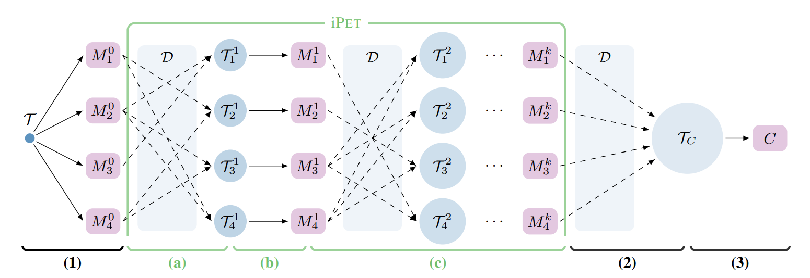
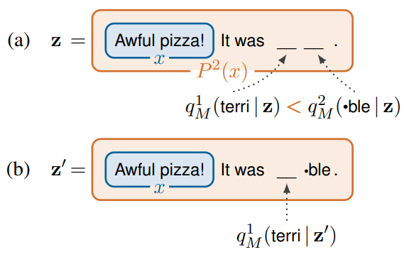

# Multi-label Classification using Pattern Exploiting Training

**Simran Karnani(4798341, S.R.Karnani@student.tudelft.nl) **

**Xin Wan(5633214, X.Wan-2@student.tudelft.nl)** 

**Ziad Nawar(4765575, ZiadAhmadSaadSolimanNawar@student.tudelft.nl)**

**Zirui Li(5463343, Z.Li-75@student.tudelft.nl)**

## Introduction
As the years go by, larger models, with billions of parameters are being trained to achieve remarkable few-shot performance. However, training these models requires an enormous amount of compute, which results in a large carbon footprint. In this, we try to use a smaller model to perform multilabel classification, through prompt engineering.

### Pattern Exploiting Training 

We start with a brief introduction to Pattern Exploiting Training(PET). PET is a semi-supervised training method, it reformulates input as cloze questions to help language models better understand the semantics.

For a mathematics definition, let $M$ be the language model with vocabulary $V$ and mask token $\_\_ \in V$. We define *pattern*, which is a function $P()$ that takes input $x$ and outputs a phase $P(x)$ that only contains 1 masks. Besides, *verbalizer* maps label $l$ to a word $v \in V$. The pair $(P, v)$ is called a *pattern-verbalizer pair*(PVP).

The probability of assigning label $l$ to input $x$ is $s_{\mathbf{p}}(l \mid \mathbf{x})=M(v(l) \mid P(\mathbf{x}))$. Then Sigmoid is applied to obtain the normalized score $q_{\mathbf{p}}(l \mid \mathbf{x})=\frac{e^{s_{\mathbf{p}}(l \mid \mathbf{x})}}{\sum_{l^{\prime} \in \mathcal{L}} e^{s_{\mathbf{p}}\left(l^{\prime} \mid \mathbf{x}\right)}}$. [^1]Then the cross entropy between $q_p$ and the one-hot vector is used for objective function.

The general procedure of PET training is that for each pattern, a language model is trained based on a small annotated dataset using supervised way. Then we use the ensemble of all language models to annotate a large unlabeled dataset, and use the new annotated dataset for the training of final tasks. This procedure is shown in the (1)~(3) in the figure[^1] below.

    
To better utilize unannotated data, an iterative version of PET(iPET) is proposed. Compare with PET, in iPET, each language model utilizes unannotated data labeled by other designated language models to train in each iteration. This process is visualized in (a)~\(c\) in the figure[^1] above.
    
Also, single token is not enough for many tasks, such as question answering. Therefore, multi-mask PET and iPET is proposed to address this problem. The difference between single-mask version and multi-mask version is the number of masks in the cloze question is different. Since there are multiple masks in the cloze question, we need a different inference strategy. During the inference, the most confident word is predicted and is inserted to the cloze question, then the probability of remaining word is computed.[^2]

 

### Multi-label Classification

In the original paper, only Binary classification tasks (predicting one of two classes) and Multi-class classification tasks (predicting one of more than two classes) are considered. What these two label classifications have in common is that an input example can only be assigned to one label in the end. 

Multi-label classification refers to those classification tasks that have two or more class labels, where one or more class labels may be predicted for each example. This is unlike binary classification and multi-class classification, where a single class label is predicted for each example. 

For instance, multi-class and binary classification imply that each sample is assigned to one and only one label: an animal can be either a cat or a dog but not both at the same time. Whereas a multi-label classification could indicate that a movie could be about romance, horror, or action all at the same time, or none of these.

### MFTC

The dataset we used was the Moral Foundations Twitter Corpus (MFTC). The data contained 35,108 tweets annotated by 3 annotators [^3]. Each tweet annotator classified each tweet for a label out of 10 categories of moral sentiments. These labels were  *fairness*, *non-moral*, *purity*, *degradation*, *loyalty*, *care*, *cheating*, *betrayal*, *subversion*, *authority*, *harm*.

### Goal of the Project

<!---
Xin
prompting , extend pet to multi label classification, 
use less data? , sota compare. 
--->

The goal of this reproduction project is to extend the PET to multilabel classification on the MFTC dataset since based on the first paper [^1] the author wrote about PET, it only works when the output to be predicted by the LM corresponds to a single token in its vocabulary, this is a severe limitation as many tasks cannot easily be worded that way. Therefore, the author improved this PET method in the second paper [^2] which is also the paper we aim to reproduce. Although the author extends PET for tasks that require predicting multiple tokens, there are still some limitations, as described before, the author only studies the performance of multi-token PET in binary and multiple classifications, while lacks research on multi-label classification, which is also our main goal of this reproduction.

## Our Method

As already mentioned, PET has been modeled for binary classification and multiclass classification. To get an understanding of how PET worked, we first reproduced it using single label classification and then moved on to multilabel classification. 

The concept of prompt engineering was used, where the tasks description is embedded in the input. So instead of giving the model a tweet and allowing it to learn the label, we used different patterns, which consisted of the tweet followed by another sentence or question, that will implicitly do the classification. 

### Patterns
The initial set of patterns that were used are the following:
* text_a, "This is about ", self.mask
* "What is the next sentence about ", text_a, ". It is about ", self.mask, "and", self.mask
* text_a, "The previous is about ", self.mask, "and", self.mask,
* "What is this for ", text_a, ". It is for ", self.mask, "and", self.mask

where text_a is the tweet and self.mask is a placeholder for the label. 

Upon realizing that some of the patterns were not naturally flowing, we decided to change them as this is a language modeling task. Thus we decided to make patterns that were more like natural language: 
* text_a, "This is about ", self.mask * num_masks
* "The tweet ", text_a, " is about ", self.mask * num_masks
* text_a, "This text can be classified as ", self.mask * num_masks
* text_a, "This belongs to the categories of ", self.mask * num_masks

where num_masks is the number of masks and varies depending on whether it is a single label classification or multilabel classification.

### Verbalizer
To do the classification, the labels were combined. Initially, combinations of four were used, however, due to the lack of resources, combinations of two were settled on. In the verbalizer, two different ways of combining the words were tried out. The words were combined either with a comma or with the word 'and'. When using the former, the masks in the patterns were separated with an 'and'. For single label, combinations of one were made. 

### Classification
Classification was first done using single labels to understand how PET worked. After this, multilabel classification was performed. When doing these classifications, it was noticed that some of the labels were split into multiple tokens. This meant that one label may require more than one mask. To counter this, the number of masks were increased. This built some curiousities, so another approach was a also taken. The labels were replaced with synonyms that were tokenized into one label only. Single label and multilabel classification was performed for these as well. 

## Experiments

We trained the data with the inital set of patterns and evaluated the performance of the PET model using the accuracy score. Initially we ran multi-label as it was our task and we found some problems.
### Attempt with inital set of patterns: 
| method\pattern | P0   | P1   | P2   | P3   |
| -------------- | ---- | ---- | ---- | ---- |
| multi label    | 0.05 | 0.06 | 0.02 | 0.02 |

### Attempt with "and" in verbalizer: 
Then we check the accuracy on single labels and inserted "and" between the labels to create the multiple labels. 

| method\pattern | P0   | P1   | P2   | P3   |
| -------------- | ---- | ---- | ---- | ---- |
| multi label    | 0.06 | 0.05 | 0.03 | none |

We also noticed that PET splits the labels into multiple tokens. Therfore we needed to update the number of masks we insert in the pattern and adapt it accordingly to the maximum number of tokens that our model create.

### Attempt with new set of patterns and synonyms: 
Additionally we changed the old labels with new labels that require less number of tokens. We changed the patterns to more language understandable patterns that the model would understand more easily.

| method\pattern            | P0   | P1   | P2   | P3   |
| ------------------------- | ---- | ---- | ---- | ---- |
| single label              | 0.48 | 0.44 | 0.49 | 0.55 |
| single label with synonms | 0.54 | 0.57 | 0.42 | 0.38 |
| multi  label with synonms | 0.06 | 0.04 | 0.05 | 0.04 |

## Conclusion & Discussion
Although we tried different ways to extend multi-mask PET to multi-label classification, we cannot achieve a satisfied results. By contrast, BERT can easily achieve accuracy of more than $63\%$ by using only a few iterations and default hyperparameters.

We reach several conclusions about why we cannot achieve promising results using PET.

1. First, we are transforming multi-label classification into a language model fine-tuning task. This means tokens that are masked must fit the natural language. However, since classification labels are all adjectives, putting several adjectives consecutively without using conjunction does not fit the natural language. This makes the fine-tuning difficult.
2. Second, even if we add conjunctions between 2 adjectives to make it fit into the pattern of natural language, it still create problems. When a language model see conjunctives, it naturally put tokens into the mask after the conjunctives. Since the number of label of each input varies, the conjunction in the pattern will mislead the language model and make the LM predict longer labels.
3. Third, the transformer-based LM is trained on its own tokenizer, which means a single word might be tokenized into multiple subword. In this situation, we cannot have conjunctions between them. But since we always insert the maximum number of masks in the training set, this will confuse the LM when the number of label is small or the tokenizer produce less subwords, making the problem the same as 1. However, we mitigate this problem by using synonyms. The synonyms we use will always be tokenized to 1 subword.
3. We also tried to insert "and" in the verbalizers, but the results are disappointed. We believe it is difficult for LM to determine which mask should it put the "and" since the number of labels varies.
3. PET is heavily relied on the quality of human-constructed patterns and verbalizers. Human factors are important in the performance of PET. However, how natural language are interpretated might be different for human and models. Therefore, it is difficult to construct suitable patterns and verbalizers.

To conclude, PET and multi-mask PET is a very powerful model for many tasks when the annotated data is limited. However, it is not applicable to multi-label classification since its nature of language modeling. Classification labels are difficult to transform into natural language, especially in the multi-label situation. Because of the uncertainty in the number of labels each input has, it is hard to design pattern that are suitable for all kinds of inputs.

## Overview of division of work

Simran writes the introductory remark in the *Introduction* section and the *Our Method* section.

Xin finishes the *Multi-label Classification* and *Goal of the Project* subsection in the *Introduction* section.

Ziad is responsible for the *MFTC* subsection and the *Experiments* section.

Zirui writes the *Pattern Exploiting Training* subsection, the *Conclusion & Discussion* section and the *Overview of division of work* section.

Everyone worked on the code together but the responsibilities of editing and running each of the specific sections are:

Simran worked on the single labels with synonyms

Xin worked on multiple labels with synonyms

Ziad worked on multiple labels 

Zirui worked on single labels

## References

[^1]: Exploiting Cloze Questions for Few Shot Text Classification and Natural Language Inference. https://arxiv.org/pdf/2001.07676.pdf
[^2]: It's Not Just Size That Matters: Small Language Models Are Also Few-Shot Learners. https://arxiv.org/pdf/2009.07118.pdf
[^3]: Moral Foundations Twitter Corpus: A collection of 35k tweets annotated for moral sentiment. https://psyarxiv.com/w4f72/